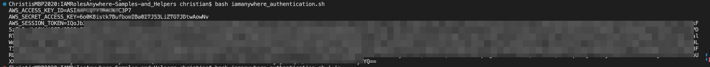

# IAM RolesAnywhere Examples

- [IAM RolesAnywhere Examples](#iam-rolesanywhere-examples)
  - [Overview](#overview)
    - [AWS Documentation](#aws-documentation)
    - [IAM RolesAnywhere Quotas](#iam-rolesanywhere-quotas)
  - [Code Coverage](#code-coverage)
  - [Repo Structure](#repo-structure)
  - [OpenSSL Bash Script | create_cert](#openssl-bash-script--create_cert)
    - [Certificate Creation | openssl_certificate.sh](#certificate-creation--openssl_certificatesh)
    - [Clean Up | cleanup.sh](#clean-up--cleanupsh)
  - [AWS CLI](#aws-cli)
    - [Custom Trust Policy | custom_trust_policy.json](#custom-trust-policy--custom_trust_policyjson)
    - [IAM Anywhere deployment script | iam_anywhere.sh](#iam-anywhere-deployment-script--iam_anywheresh)
  - [Terraform](#terraform)
    - [File Structure](#file-structure)
    - [Certificate Management | tls.tf](#certificate-management--tlstf)
      - [rootCA.pem](#rootcapem)
      - [server.key and server.pem](#serverkey-and-serverpem)
    - [IAM and IAM RolesAnywhere | iam.tf](#iam-and-iam-rolesanywhere--iamtf)
      - [Outputs | outputs.tf](#outputs--outputstf)
  - [Authenticating to IAM RolesAnywhere](#authenticating-to-iam-rolesanywhere)

## Overview

Our intended audience assumes an existing understanding of AWS IAM Services, and experience with the provided template configuration languages.

No experience/knowledge with tls certificates is required, although it is useful for providing enhanced security.

We recommend fully reviewing [IAM RolesAnywhere Security](https://docs.aws.amazon.com/rolesanywhere/latest/userguide/security.html) documentation to create a mature and secure solution


### [AWS Documentation](https://docs.aws.amazon.com/rolesanywhere/latest/APIReference/Welcome.html)

AWS Identity and Access Management Roles Anywhere provides a secure way for your workloads such as servers, containers, and applications that run outside of AWS to obtain temporary AWS credentials. Your workloads can use the same IAM policies and roles you have for native AWS applications to access AWS resources. Using IAM Roles Anywhere eliminates the need to manage long-term credentials for workloads running outside of AWS.

To use IAM Roles Anywhere, your workloads must use X.509 certificates issued by their certificate authority (CA) . You register the CA with IAM Roles Anywhere as a trust anchor to establish trust between your public key infrastructure (PKI) and IAM Roles Anywhere. If you don't manage your own PKI system, you can use AWS Certificate Manager Private Certificate Authority to create a CA and then use that to establish trust with IAM Roles Anywhere.

This guide describes the IAM Roles Anywhere operations that you can call programmatically. For more information about IAM Roles Anywhere, see the IAM Roles Anywhere User Guide.

### [IAM RolesAnywhere Quotas](https://docs.aws.amazon.com/rolesanywhere/latest/userguide/load-balancer-limits.html)

| Resource                               | Description                                                  | Default value | Adjustable |
| -------------------------------------- | ------------------------------------------------------------ | ------------- | ---------- |
| Combined rate of trust anchor requests | The maximum transactions per second for  ListTrustAnchors, CreateTrustAnchor, GetTrustAnchor, UpdateTrustAnchor,  DeleteTrustAnchor, EnableTrustAnchor, and DisableTrustAnchor requests  combined. | 1 per second  | Yes        |
| Combined rate of profile requests      | The maximum transactions per second for  ListProfiles, CreateProfile, GetProfile, UpdateProfile, DeleteProfile,  EnableProfile, and DisableProfile requests combined. | 1 per second  | Yes        |
| Combined rate of subject requests      | The maximum transactions per second for ListSubjects and GetSubject requests combined. | 1 per second  | Yes        |
| Combined rate of tagging requests      | The maximum transactions per second for TagResource, UntagResource, and ListTagsForResource requests combined. | 1 per second  | Yes        |
| Combined rate of CRL requests          | The maximum transactions per second for  ListCrls, GetCrl, ImportCrl, UpdateCrl, DeleteCrl, EnableCrl, and  DisableCrl requests combined. | 1 per second  | Yes        |
| Rate of CreateSession requests         | The maximum transactions per second for CreateSession requests. | 10 per second | Yes        |
| Trust anchors                          | The maximum number of trust anchors that you can create within an account. | 50            | Yes        |
| Profiles                               | The maximum number of profiles that you can create within an account. | 250           | Yes        |
| CRLs per trust anchor                  | The maximum number of Certificate Revocation Lists (CRLs) that you can create per trust anchor within an account. | 2             | No         |
| Certificates per trust anchor          | The maximum number of certificates that you can create per trust anchor within an account. | 2             | No         |

## Code Coverage 

This repo will include code examples for IAM RolesAnywhere deployment with:

+ [OpenSSL Bash Scripts to generate Certificates](#openssl-bash-script--create_cert)
+ [AWS CLI Deployment Sample](#aws-cli)
+ ~~AWS CloudFormation Sample~~
+ [Terraform AWS Provider Sample](#terraform)
+ [Bash IAM RolesAnywhere Authentication Sample](#authenticating-to-iam-rolesanywhere)


## Repo Structure

This repo is created to provide a set of sample code and scripts, that can be copied and repurposed for use within environments, and pipelines.

For this reason, there is no basic "install process", only guidelines for use.

| Directory               | Description                                                  |
| ----------------------- | ------------------------------------------------------------ |
| aws_cli                 | AWS CLI scripts for creating IAM RolesAnywhere Resources     |
| cloudformation          | AWS Cloudformation Template to create IAM RolesAnywhere Resources |
| create_cert             | Bash script to create Certificates for IAM RolesAnywhere Authentication |
| download_signing_helper | Bash script to dowload Sign-In Helper app                    |
| terraform               | Terraform AWS Provider configuration files to create IAM RolesAnywhere Resources |


## OpenSSL Bash Script | create_cert

The directory contains two bash scripts.

### Certificate Creation | openssl_certificate.sh

This script references a number of input variables to create a self-signed certificate.


| Variable               | Description                                                  |
| ---------------------- | ------------------------------------------------------------ |
| VAR_PREREQ_SOFTWARE    | List of packages to check for, default is only openssl       |
| VAR_CERT_COUNTRYNAME   | Two digit country name (i.e. US, or CA)                      |
| VAR_CERT_STATEPROVINCE | Full name of State or Province                               |
| VAR_CERT_LOCALITY      | Locality, such as city or area                               |
| VAR_CERT_ORGNAME       | Organizations full Name                                      |
| VAR_CERT_OU            | Organizational Unit/Department                               |
| VAR_CERT_COMMONNAME    | Common Name, does not have to be a fqdn for this purpose     |
| VAR_CERT_CN            | fqdn                                                         |
| VAR_CERT_OU2           | Additional OU that is used for authentication validation (i.e. home) |

The certificate is created by providing variables and executing the script.  The sample scripts/configuration files included in this repository may reference the created artifacts, however it is recommended that the script be cusomtized with desired output location.

### Clean Up | cleanup.sh

Simple script that will remove any generated certificate files from testing. 


## AWS CLI

Q: Why do we include AWS CLI, when our preferred method is using IaC?

A: There are many reasons why we include CLI, but primarily our IaC development process with new (or new to us) API's/Services is to experiment with CLI first, and then create Cloudformation/Terraform templates.  This way our testing is abstracted from potential tooling issues, and coverage from IaC. At times coverage is lacking from IaC, and although CLI does not provide management of deployed resources, it does at least provide a versioned approach with consistant and repeatable use.

### Custom Trust Policy | custom_trust_policy.json

IAM RolesAnywhere requires a custom trust policy to be used. 

For our example, we have added a Condition for StringEquals to ensure our certificate for use contains the `OU:home` as an example of how we can lock down acccess based on certificate content. This example is specific to our test case, is not required, and can be easily customized to meet your requirements.

```json
{
  "Version": "2012-10-17",
  "Statement": [
      {
          "Effect": "Allow",
          "Principal": {
              "Service": "rolesanywhere.amazonaws.com"
          },
          "Action": [
              "sts:AssumeRole",
              "sts:TagSession",
              "sts:SetSourceIdentity"
          ],
          "Condition": {
              "StringEquals": {
                  "aws:PrincipalTag/x509Subject/OU": "home"
              }
          }
      }
  ]
}
```

### IAM Anywhere deployment script | iam_anywhere.sh

This is a simple deployment script, for deployment.  It accepts a small set of variables to generate the requried resources.


| Variables              | Description                                                  |
| ---------------------- | ------------------------------------------------------------ |
| VAR_IAMROLENAME        | Role-name to be used. This is repurposed with suffixes add for reference in the script |
| VAR_509CERT            | This should contain your rootCA Private Certificate. It should start with the -----BEGIN CERTIFICATE----- statement and end with -----END CERTIFICATE----- |
| VAR_IAMPOLICIES_LIST   | A list of managed IAM Policies to attach to the IAM Role     |
| VAR_IAMPATH            | The path for the role. It must begin and end with a forward slash |
| VAR_IAMROLEDESCRIPTION | A short, friendly desription for the Role. i.e. "Dev Pipeline Role" |

The sample script will then:

+ Create the IAM Role
+ Attach the IAM Policies to the IAM Role
+ Create the RolesAnywhere Trust Anchor with the x509 certificate data
+ Create the RolesAnywhere Profile and associates it with the IAM Role


## Terraform

The Terraform samples utilizes three providers to create an end-to-end deployment skeleton:

+ [hashicorp/aws](https://registry.terraform.io/providers/hashicorp/aws/latest)
+ [hashicorp/local](https://registry.terraform.io/providers/hashicorp/local/latest)
+ [hashicorp/tls](https://registry.terraform.io/providers/hashicorp/tls/latest)


### File Structure

| Filename         | Description                                                  |
| ---------------- | ------------------------------------------------------------ |
| iam.tf           | Configuration file that creates IAM and IAM RolesAnywhere resources |
| my.tfvars.sample | Sample of tfvars for consumption by terraform                |
| terraform.tf     | Terraform and Providers configuration                        |
| tls.tf           | Configuration file that creates the certificates             |
| variables.tf     | Configuration file that defines the variables                |

### Certificate Management | tls.tf

Certificate Management is handled via the tls.tf configuration file, creating self-signed certificates.

We output three key certificate files. Two files are use by the `aws_signing_helper` helper binary, and one file is consumed within the terraform. 

The direct export of files to local disk is a design artifact of providing sample templates, and a better practice would be to utilize externalized vault storage (i.e. parameter store) for these values to manage risk.

#### rootCA.pem

The file rootCA.pem is created in tls.tf

```hcl
resource "local_file" "rootca_pem" {
  content  = tls_self_signed_cert.ca.cert_pem
  filename = "${path.module}/rootCA.pem"
}
```

This is then consumed within the iam.tf configuration file to be associated with the trust anchor

```hcl
resource "aws_rolesanywhere_trust_anchor" "name" {
  enabled = true
  name    = "${var.iam.name_prefix}-anchor"
  source {
    source_type = "CERTIFICATE_BUNDLE"
    source_data {
      x509_certificate_data = local_file.rootca_pem.content
    }
  }
}
```

#### server.key and server.pem

These two files are generated for consumption by the `aws_signing_helper` script.

```hcl
resource "local_file" "server_key" {
  content  = tls_private_key.cert.private_key_pem
  filename = "${path.module}/server.key"
}

resource "local_file" "server_pem" {
  content  = tls_locally_signed_cert.cert.cert_pem
  filename = "${path.module}/server.pem"
}
```

The `aws_signing_helper` script uses these for `--certificate` and `--private-key` parameters

```shell
  ./aws_signing_helper credential-process \
    --certificate ./terraform/server.pem --private-key ./terraform/server.key \
    --trust-anchor-arn "$VAR_TRUST_ANCHOR_ARN" \
    --profile-arn "$VAR_PROFILE_ARN" \
    --role-arn "$VAR_ROLE_ARN"
```


### IAM and IAM RolesAnywhere | iam.tf

The template provide generates a single IAM Role as an example, and associates the ReadOnly managed IAM Policy to it.

IAM RolesAnywhere Trust Anchor is created, and matched to the x509 certificate created in the tls.tf configuration file, then an IAM RolesAnywhere Profile is associated to the IAM Role originally generated.

The ARN's for for these three resources are required for the `aws_signing_helper` script.


#### Outputs | outputs.tf

The `aws_signing_helper` requires three variables for authentication.

+ IAM RolesAnywhere Trust Anchor ARN
+ IAM RolesAnywhere Profile ARN
+ IAM Role ARN

For external integration, our templates includes these as specific Terraform Outputs

```hcl
output "trust_anchor_arn" {
  value = aws_rolesanywhere_trust_anchor.name.arn
}

output "trust_profile_arn" {
  value = aws_rolesanywhere_profile.test.arn
}

output "iam_role" {
  value = aws_iam_role.this.arn
}
```


## Authenticating to IAM RolesAnywhere

[AWS Source Documentation](https://docs.aws.amazon.com/rolesanywhere/latest/userguide/credential-helper.html)

AWS Provides the `aws_signing_helper` tool that provides an easy to use CLI method for obtaining temporary credentials for login.

We provide a sample shell script for using this tool to generate a temporary credential set with the generated certificates.

The shell script needs the relevant IAM Role and IAM RolesAnywhere ARN's provided to it as variables:

```shell
VAR_TRUST_ANCHOR_ARN=""
VAR_PROFILE_ARN=""
VAR_ROLE_ARN=""
```

The shell script contains a simple function to authenticate with:

+ update `--certificate` with the path to your own `server.pem` file
+ update the `--private-key` with the path to your own `server.key` file

```shell
get-credentials () {
  ./aws_signing_helper credential-process \
    --certificate ./terraform/server.pem --private-key ./terraform/server.key \
    --trust-anchor-arn "$VAR_TRUST_ANCHOR_ARN" \
    --profile-arn "$VAR_PROFILE_ARN" \
    --role-arn "$VAR_ROLE_ARN"
}
```

Once the variables are updated, and then certificate and private-key locations corrected, the script can be executed.

By default it will only `echo` the obtained keys into the shell session. We do provide a function export them also, but it is important to remember these are designed as sample templates and by default the session authentication remains in the executed sub shell.



